# Sistema de Recomendação Personalizada de Técnicas de Estudo

> **Trabalho de Conclusão de Curso (TCC)**  
> Bacharelado em Ciência da Computação - UNISINOS  
> **Autor:** Felipe de Oliveira Brenner  
> **Orientadora:** Profa. Dra. Rosemary Francisco

## 📋 Sobre o Projeto

Este projeto foi desenvolvido como Trabalho de Conclusão de Curso (TCC) do Bacharelado em Ciência da Computação da Universidade do Vale do Rio dos Sinos (UNISINOS). O sistema utiliza Inteligência Artificial, especificamente a API do ChatGPT (GPT-4o mini), para fornecer recomendações personalizadas de técnicas de estudo baseadas no histórico acadêmico dos estudantes universitários.

### Problema de Pesquisa

Muitos estudantes universitários enfrentam dificuldades significativas ao tentar gerenciar seu tempo de estudo e identificar estratégias eficazes para melhorar seu desempenho acadêmico. Esses desafios são amplificados pela complexidade e quantidade de conteúdos a serem assimilados.

### Objetivo

Desenvolver um sistema inteligente que analise o perfil acadêmico de um estudante universitário e sugira um plano de estudos personalizado para melhorar o desempenho acadêmico através de técnicas de estudo baseadas em evidências científicas.

## 🎯 Funcionalidades

### Requisitos Funcionais Implementados

- **RF001 - Autenticação de Aluno**: Sistema de autenticação simples utilizando contas Google ou GitHub, com armazenamento inteligente de informações do usuário.

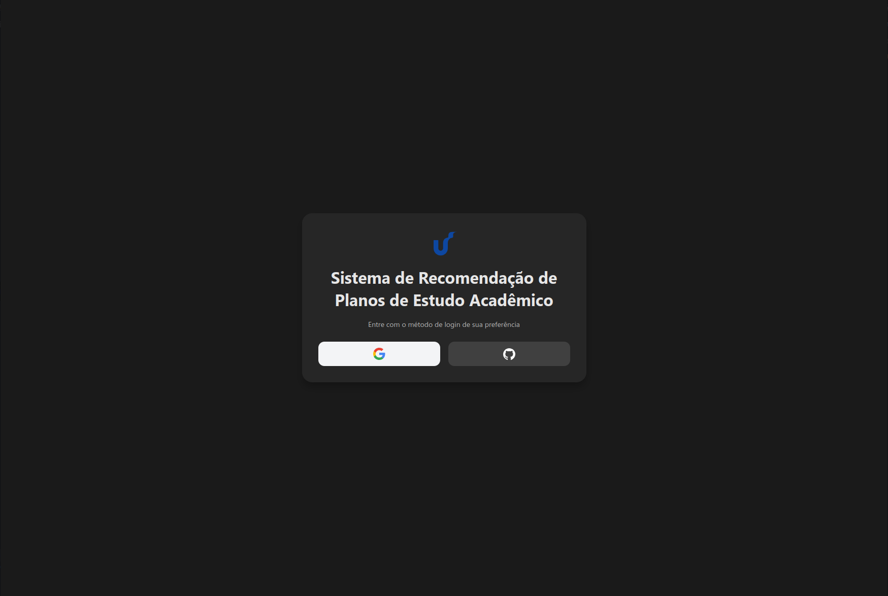

- **RF002 - Upload de Histórico Acadêmico**: Permite que o aluno faça upload de seu histórico acadêmico em formato PDF, com instruções sobre como gerar o documento na plataforma da universidade.

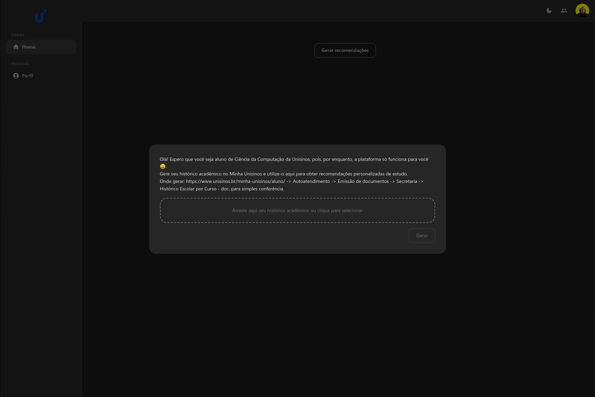

- **RF003 - Geração Limitada de Recomendações**: Sistema que permite gerar recomendações com um número limitado de tentativas, considerando custos da API e possíveis erros de leitura.

- **RF004 - Exibição de Dados Identificados**: Exibe todos os dados identificados do histórico acadêmico, incluindo informações de identificação e tabela com disciplinas, períodos e notas.

- **RF005 - Recomendações de Técnicas de Estudo**: Fornece recomendações personalizadas de técnicas de estudo baseadas no desempenho acadêmico, incluindo:

  - Método Pomodoro
  - Matriz de Eisenhower
  - Técnica de Time Blocking
  - Regra dos Dois Minutos
  - Estabelecimento de Metas (SMART)
  - Feedback Positivo
  - Modelagem
  - Autoinstrução
  - Mapas Mentais
  - Autoquestionamento
  - Técnica SQ3R
  - Diários de Aprendizagem
  - Organizadores Gráficos

<p align="center">
  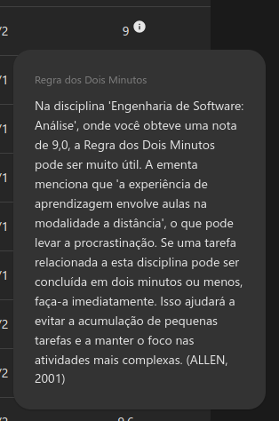
  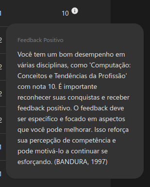
  
</p>
<p align="center">
  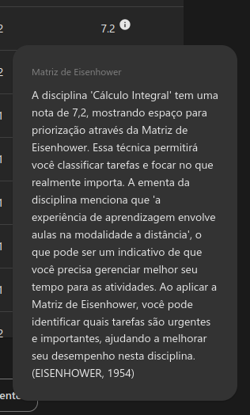
  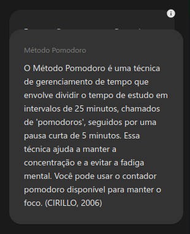
  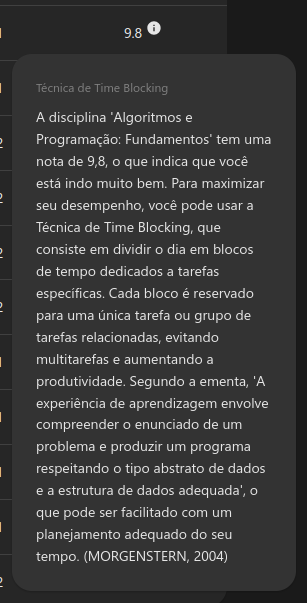
</p>

- **RF006 - Método Pomodoro**: Contador Pomodoro integrado para auxiliar no gerenciamento de tempo de estudo.

- **RF007 - Estabelecimento de Metas**: Calendário interativo para agendamento de tarefas e metas de estudo.

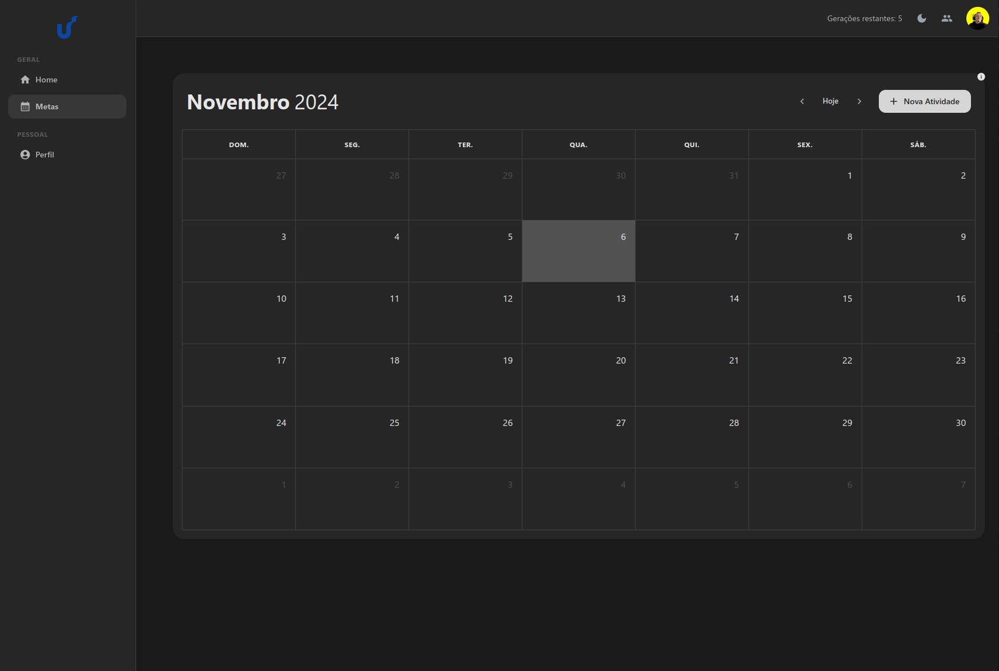

- **RF008 - Compartilhamento de Dados**: Recurso opcional para compartilhar dados acadêmicos com outros usuários do sistema, permitindo visualização de médias globais e histórico de outros estudantes.


### Tela Principal

Após o processamento do histórico acadêmico, o sistema exibe a tela principal com todas as informações identificadas e recomendações disponíveis:

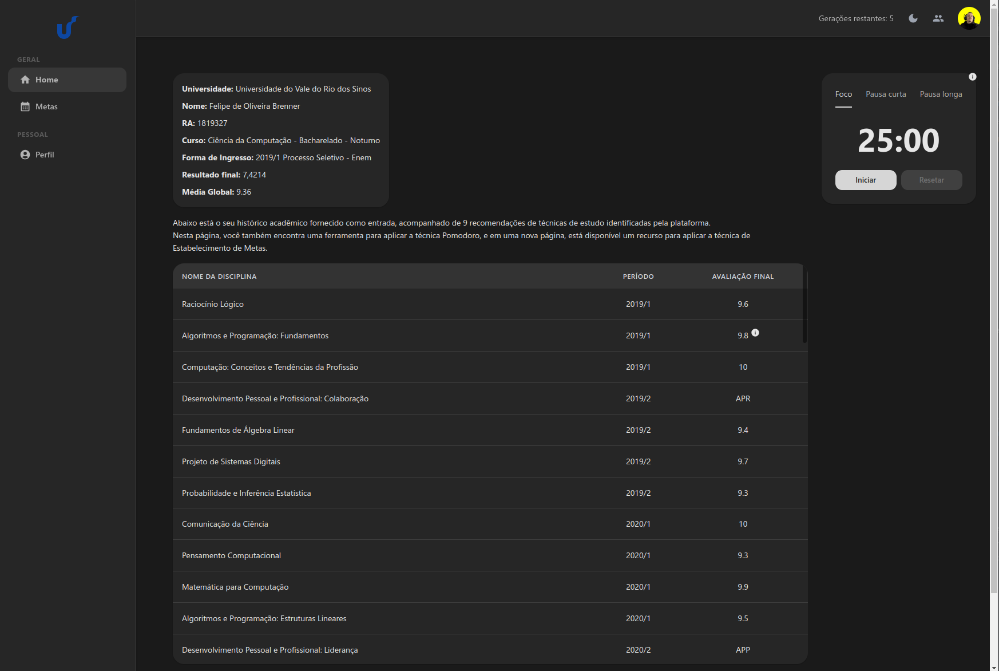

## 🛠️ Tecnologias Utilizadas

### Frontend

- **React 18.3.1** - Biblioteca JavaScript para construção de interfaces
- **TypeScript 5.2.2** - Superset do JavaScript com tipagem estática
- **Vite 5.3.4** - Build tool e dev server
- **Material-UI (MUI) 5.16.4** - Biblioteca de componentes React
- **React Router 6.25.1** - Roteamento para aplicações React
- **TanStack Query 5.51.16** - Gerenciamento de estado do servidor
- **FullCalendar 5.10.1** - Componente de calendário interativo
- **Formik 2.4.6** + **Yup 1.4.0** - Gerenciamento e validação de formulários
- **React Dropzone 14.2.9** - Upload de arquivos com drag and drop
- **React Toastify 10.0.5** - Sistema de notificações

### Backend & Serviços

- **Firebase 10.12.4** - Backend as a Service (BaaS)
  - Firebase Authentication (Google & GitHub)
  - Cloud Firestore (Banco de dados NoSQL)
  - Cloud Storage (Armazenamento de arquivos)
- **OpenAI API 4.53.2** - API de Assistants com GPT-4o mini
  - Code Interpreter para processamento de PDFs
  - Assistants API para geração de recomendações

### Ferramentas de Desenvolvimento

- **Biome 1.8.3** - Linter e formatter
- **Vercel** - Plataforma de deploy e hospedagem

## 🏗️ Arquitetura

O sistema foi desenvolvido seguindo uma arquitetura moderna de aplicação web, utilizando:

- **Frontend**: Aplicação React com TypeScript, hospedada na Vercel
- **Backend**: Firebase como BaaS, fornecendo autenticação, banco de dados e armazenamento
- **IA**: OpenAI Assistants API com GPT-4o mini para processamento e geração de recomendações

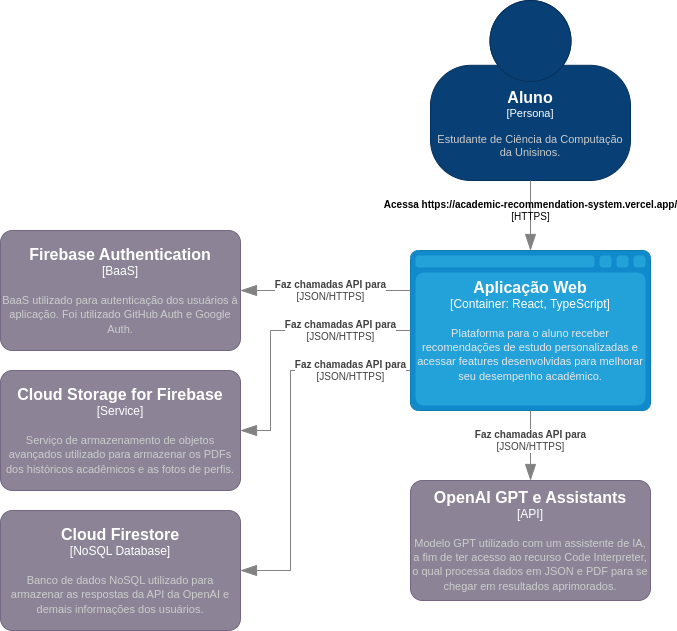

### Fluxo de Funcionamento

1. **Autenticação**: Usuário se autentica via Google ou GitHub
2. **Upload**: Usuário faz upload do histórico acadêmico em PDF
3. **Processamento**: O arquivo é enviado para a API de Assistants da OpenAI
4. **Análise**: O GPT processa o histórico utilizando Code Interpreter e gera recomendações personalizadas
5. **Armazenamento**: Recomendações são salvas no Firestore
6. **Visualização**: Usuário visualiza recomendações e utiliza recursos adicionais (Pomodoro, Calendário)

## 📊 Resultados da Avaliação

O sistema foi avaliado utilizando a **System Usability Scale (SUS)**, uma métrica amplamente reconhecida para avaliação de usabilidade.

### Pontuação SUS: **90.5**

De acordo com as escalas de interpretação:

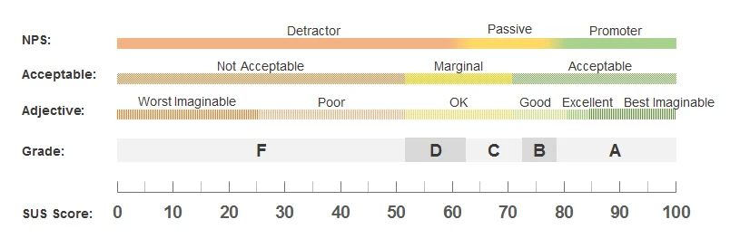

- **NPS**: Promotor
- **Aceitabilidade**: Aceitável
- **Adjetivo**: Melhor Imaginável
- **Nota**: A

### Principais Feedback dos Usuários

**Vantagens identificadas:**

- Disponibilização de técnicas de estudo personalizadas baseadas no desempenho acadêmico
- Cálculo e exibição da média global atualizada
- Interface intuitiva, leve e responsiva
- Gerenciamento de tempo integrado à ferramenta

**Utilidade percebida:**

- Análise do histórico acadêmico e identificação de padrões
- Motivação para melhorar o desempenho acadêmico
- Dicas sobre produtividade
- Organização dos estudos

## 🚀 Como Executar

### Pré-requisitos

- Node.js 18+ e pnpm (ou npm/yarn)
- Conta Firebase configurada
- Chave de API da OpenAI

### Instalação

1. Clone o repositório:

```bash
git clone https://github.com/FelipeBrenner/academic-recommendation-system.git
cd academic-recommendation-system
```

2. Instale as dependências:

```bash
pnpm install
```

3. Configure as variáveis de ambiente:

Crie um arquivo `.env` na raiz do projeto com as seguintes variáveis:

```env
# Firebase
VITE_FIREBASE_API_KEY=your_firebase_api_key
VITE_FIREBASE_AUTH_DOMAIN=your_auth_domain
VITE_FIREBASE_PROJECT_ID=your_project_id
VITE_FIREBASE_STORAGE_BUCKET=your_storage_bucket
VITE_FIREBASE_MESSAGING_SENDER_ID=your_messaging_sender_id
VITE_FIREBASE_APP_ID=your_app_id
VITE_FIREBASE_MEASUREMENT_ID=your_measurement_id

# OpenAI
VITE_OPENAI_API_KEY=your_openai_api_key
```

4. Execute o projeto em modo de desenvolvimento:

```bash
pnpm dev
```

5. Para build de produção:

```bash
pnpm build
```

6. Para preview do build:

```bash
pnpm preview
```

## 📚 Fundamentação Teórica

O sistema é baseado em teorias e técnicas amplamente estudadas na literatura acadêmica:

### Gerenciamento de Tempo

- Método Pomodoro (Cirillo, 2006)
- Matriz de Eisenhower (Eisenhower, 1954)
- Time Blocking (Morgenstern, 2004)
- Regra dos Dois Minutos (Allen, 2001)

### Crenças de Autoeficácia e Percepção de Competência

- Estabelecimento de Metas SMART (Locke & Latham, 1990)
- Feedback Positivo (Bandura, 1997)
- Modelagem (Schunk, 1987)
- Autoinstrução (Meichenbaum, 1977)

### Estratégias Cognitivas e Metacognitivas

- Mapas Mentais (Buzan, 1993)
- Autoquestionamento (King, 1992)
- Técnica SQ3R (Robinson, 1970)
- Diários de Aprendizagem (Ziegler, 2001)
- Organizadores Gráficos (Novak & Gowin, 1998)

## 📖 Metodologia

O trabalho foi desenvolvido utilizando a metodologia **Design Science Research (DSR)**, que compreende as seguintes etapas:

1. **Identificação do Problema e Motivação**
2. **Definição dos Objetivos da Solução**
3. **Projeto e Desenvolvimento do Artefato**
4. **Demonstração**
5. **Avaliação**
6. **Comunicação**

## ⚠️ Limitações Conhecidas

- **Modelo GPT**: Utilização do GPT-4o mini (modelo de baixo custo) pode apresentar limitações na precisão e detalhamento das recomendações
- **Amostra de Avaliação**: Pequena amostra de usuários (5 participantes) limita a generalização dos resultados
- **Público-alvo**: Avaliação realizada principalmente com estudantes de semestres avançados
- **Curso Específico**: Atualmente, as ementas das disciplinas estão disponíveis apenas para o curso de Ciência da Computação

## 🔮 Trabalhos Futuros

- Integração com calendário acadêmico do semestre corrente
- Implementação de sistema de pontuação e recompensas
- Melhorias no recurso de compartilhamento para evitar sentimentos negativos
- Testes com estudantes de semestres iniciais
- Investimento em modelos GPT mais avançados
- Integração com plataforma da universidade para acesso automático a dados
- Expansão para outros cursos além de Ciência da Computação

## 📄 Licença

Este projeto foi desenvolvido como trabalho acadêmico. Todos os direitos reservados.

## 👤 Autor

**Felipe de Oliveira Brenner**  
Graduando em Ciência da Computação pela UNISINOS

---

**Nota**: Este projeto foi desenvolvido como requisito parcial para obtenção do título de Bacharel em Ciência da Computação pela Universidade do Vale do Rio dos Sinos (UNISINOS).
